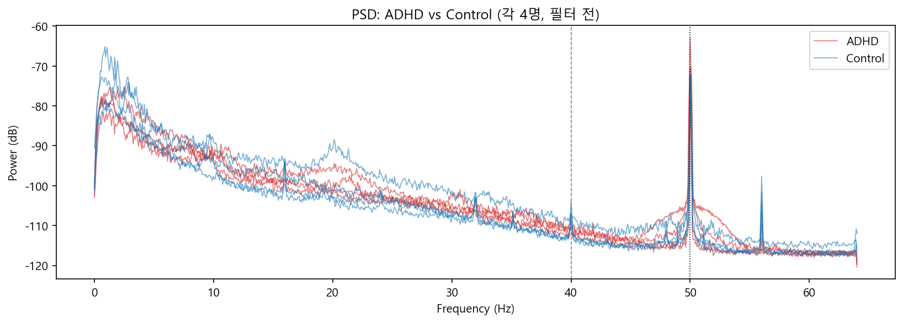
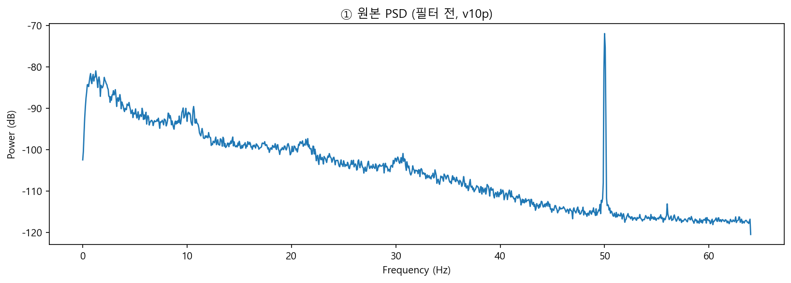
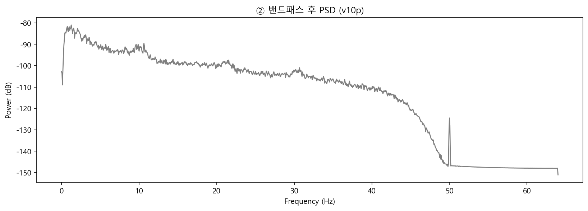
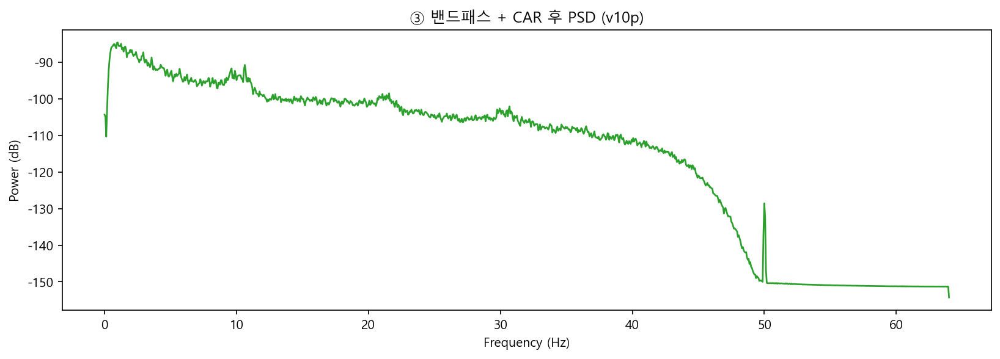
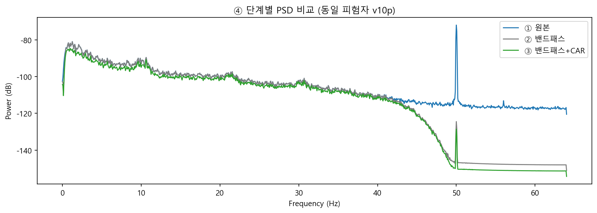

# 전처리 진행 로그

각 전처리 단계의 figure와 메모. `fig_utils.save_fig()`로 자동 갱신됨.

<!-- fig:01 -->
## 01. group_psd

ADHD 4 + Control 4 원본 PSD. 40Hz 위 공통 신경신호 없음 → H_FREQ=40 근거. 50Hz 라인노이즈 확인.

<!-- /fig:01 -->

<!-- fig:02 -->
## 02. psd_raw

① 원본 PSD(v10p). 40Hz 위까지 파워 이어지고 50Hz 라인노이즈 보임.

<!-- /fig:02 -->

<!-- fig:03 -->
## 03. psd_bandpass

② 밴드패스 후. 40Hz 위 절단, 0.5Hz 미만 표류 정리됨.

<!-- /fig:03 -->

<!-- fig:04 -->
## 04. psd_car

③ 밴드패스+CAR 후. 공통성분만큼 1–30Hz 하강, 알파 봉우리 유지.

<!-- /fig:04 -->

<!-- fig:05 -->
## 05. psd_stages

④ 원본·밴드패스·+CAR 오버레이. 고주파 절단과 전체 하강을 한눈에 비교.

<!-- /fig:05 -->
